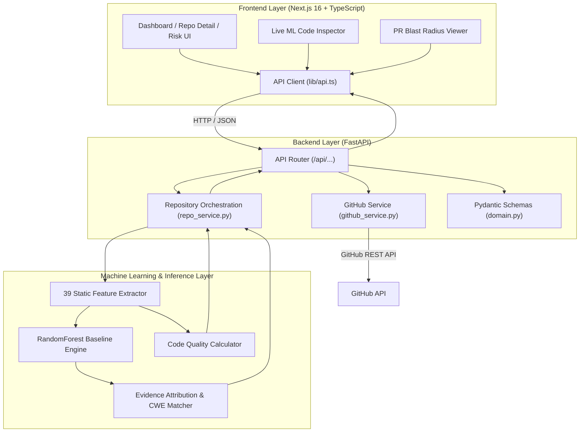

<div align="center">

# 🛰️ SkyTrace — Repository Intelligence AI

### *Predict Defects • Uncover Vulnerabilities • Analyze Pull Request Blast Radius • Map Dependency Call-Graphs*

[](https://www.python.org/)
[](https://nextjs.org/)
[](https://fastapi.tiangolo.com/)
[](https://tailwindcss.com/)
[](https://www.typescriptlang.org/)
[](LICENSE)

---

**SkyTrace** is an end-to-end AI platform for repository intelligence and code health analysis. It seamlessly analyzes public GitHub repositories and raw code snippets, utilizing static feature extraction (39 static code metrics) paired with machine learning inference to predict defect probabilities, highlight security risks, assess pull-request blast radius, and provide explainable AI reasoning.

[Key Features](#-key-features) • [Architecture](#-architecture-overview) • [Quick Start](#-quick-start) • [ML Pipeline](#-how-the-ml-pipeline-works) • [API Reference](#-key-api-endpoints) • [Testing](#-testing--verification)

---
</div>

## ✨ Key Features

| Feature | Description |
|---|---|
| 🔍 **Live GitHub Repository Analysis** | Connect any public GitHub repository (e.g. `expressjs/express`, `pallets/flask`) with real-time fetch, code structure analysis, commit metrics, and live polling. |
| 🛡️ **Multi-Dimensional Risk Engine** | Evaluates code across **Defect Risk**, **Security Risk**, and **Regression Risk** with normalized 0–100% scores and severity classifications (`CRITICAL`, `HIGH`, `MEDIUM`, `LOW`). |
| 💥 **PR Blast Radius & Risk Assessment** | Simulates and quantifies the impact of incoming Pull Requests across downstream modules, breaking changes, and risk levels before merging. |
| 🕸️ **Interactive Call-Graph & Dependency Topology** | Visualizes component relationships, file couplings, static centrality, and co-change clusters with interactive graph layouts. |
| 🧪 **Real-Time Code Inspector** | Paste any source code snippet directly in the UI for instant sub-second ML feature extraction, flaw detection, and vulnerability pattern matching. |
| 🧠 **Explainable AI Attribution** | Provides exact `EvidenceFactors` explaining risk scores (e.g. *Unsafe API usage (+34%)*, *Excessive cyclomatic complexity (+28%)*) with CWE/CVE references. |

---

## 🏗️ Architecture Overview

SkyTrace unites a high-performance **Next.js 16 frontend**, a **FastAPI backend orchestration service**, and a **Machine Learning inference engine** into a unified microservices system.



### 🔄 End-to-End Prediction & Analysis Pipeline

```text
User Input / GitHub Repo URL
          │
          ▼
FastAPI Validation (Pydantic domain schemas)
          │
          ▼
GitHub Integration / Local AST Parser (39 Code Features)
          │
          ▼
Random Forest Classifier Inference Engine (rf_baseline.joblib)
          │
          ▼
Multi-Risk Calibration (Defect %, Security %, Regression %)
          │
          ▼
Explainable Evidence Factors & CWE Vulnerability Matching
          │
          ▼
Structured JSON Response ──► Interactive UI / Graphs / Health Score
```

---

## 📁 Project Structure

```text
SkyTrace/
├── frontend/                     # Next.js 16 + Tailwind CSS v4 + TypeScript
│   ├── app/                      # Next.js App Router (Dashboard, Repos, Components, Graph, PRs)
│   ├── components/               # UI Components (shadcn/ui, topology graph, ML inspector)
│   ├── lib/
│   │   ├── api.ts                # Backend API client with automatic offline fallback
│   │   ├── types.ts              # TypeScript domain contracts
│   │   └── mock-data.ts          # Resilient seed data
│   └── package.json
│
├── backend/                      # FastAPI Backend & ML Orchestration
│   ├── app/
│   │   ├── api/                  # API Routers & Endpoint definitions
│   │   │   └── endpoints.py      # Repository, Component, Graph, PR, & Predict endpoints
│   │   ├── core/                 # Config & CORS setup (config.py)
│   │   ├── schemas/              # Pydantic data contracts (domain.py)
│   │   ├── services/             # GitHub API integration & Repo state management
│   │   │   ├── github_service.py # Live GitHub API integration & repo fetcher
│   │   │   └── repo_service.py   # In-memory repo repository & analysis runner
│   │   └── main.py               # FastAPI entrypoint
│   │
│   ├── ml/                       # Machine Learning Inference Engine
│   │   ├── features/             # 39 static feature extractors & static metrics
│   │   ├── inference/            # Production model inference engine (engine.py)
│   │   ├── models/               # Model architectures (Random Forest, CodeBERT)
│   │   └── weights/              # Serialized model weights (rf_baseline.joblib)
│   └── requirements.txt
│
├── tests/                        # Comprehensive Automated Test Suite
│   ├── test_api.py               # FastAPI endpoint tests
│   ├── test_github_service.py    # GitHub API integration tests
│   ├── test_analysis_polling.py  # Repository analysis polling lifecycle tests
│   ├── test_pr_blast_radius.py   # PR blast radius calculation tests
│   ├── test_inference.py         # Static feature extraction & model inference tests
│   └── test_e2e_flow.py          # End-to-end system flow integration tests
│
├── scripts/                      # Developer scripts & launchers
│   └── dev.sh                    # Dual-service launcher script
│
├── docker-compose.yml            # Container orchestration for Full Stack
├── .env.example                  # Environment configuration template
└── README.md                     # Project documentation
```

---

## ⚡ Quick Start

### 📋 Prerequisites

* **Python**: `3.10` or higher
* **Node.js**: `18.18` or higher (`20+` recommended)
* **npm**: `9.0` or higher

---

### 1️⃣ Clone & Setup Environment

```bash
git clone https://github.com/kaigharat/SKYTrace.git
cd SKYTrace

# Copy environment file
cp .env.example .env
```

---

### 2️⃣ Install Backend Dependencies

```bash
# Create virtual environment (optional but recommended)
python -m venv .venv

# Windows Powershell:
.\.venv\Scripts\activate
# Linux/macOS:
source .venv/bin/activate

# Install requirements
pip install -r backend/requirements.txt
```

---

### 3️⃣ Install Frontend Dependencies

```bash
cd frontend
npm install
cd ..
```

---

### 4️⃣ Launch the Application

#### Option A: Run Individually (Recommended for development)

**Terminal 1 — Backend (FastAPI):**
```bash
# Windows:
.\.venv\Scripts\python.exe -m uvicorn backend.app.main:app --host 127.0.0.1 --port 8000 --reload

# Linux / macOS:
uvicorn backend.app.main:app --host 127.0.0.1 --port 8000 --reload
```
* **API Server**: `http://localhost:8000`
* **Swagger Documentation**: `http://localhost:8000/docs`

**Terminal 2 — Frontend (Next.js):**
```bash
cd frontend
npm run dev
```
* **Web Dashboard**: `http://localhost:3000`

#### Option B: Using Docker Compose

```bash
docker-compose up --build
```

---

## 🤖 How the ML Pipeline Works

The SkyTrace ML engine processes source code through a multi-stage pipeline:

1. **Static Feature Extraction (`backend/ml/features/static_features.py`)**:
   - Parses code snippets or repository source files.
   - Extracts **39 static features** including:
     - **Syntactic Complexity**: `cyclomaticComplexity`, `n_branches_if`, `n_loops_while`, `n_switch`, `n_distinct_tokens`.
     - **Code Volume**: `length_chars`, `n_lines`, `n_code_lines`, `avg_line_length`.
     - **Security-Critical Operations**: `has_strcpy`, `has_gets`, `has_sprintf`, `has_malloc`, `has_free`, `has_memcpy`, `has_cast`.
2. **Model Inference Engine (`backend/ml/inference/engine.py`)**:
   - Evaluates vectors against a trained `RandomForestBaseline` (300 estimators with balanced class weighting).
   - Generates calibrated multi-dimensional risk metrics.
3. **Risk Scoring Categories**:
   - 🔴 **Defect Risk**: Likelihood of software bugs, driven by complexity and volume.
   - 🛡️ **Security Risk**: Vulnerability profile, driven by dangerous functions and unsafe operations.
   - ⚡ **Regression Risk**: Risk of regression on edit, driven by coupling and dependency metrics.
4. **Explainable AI Attribution (`EvidenceFactor`)**:
   - Breaks down exact contributing factors with percentage weights explaining *why* the component was flagged.
5. **CWE Pattern Matching**:
   - Matches code signatures against common vulnerability types (e.g. `CWE-120: Buffer Copy without Checking Size`, `CWE-79: Cross-Site Scripting`).

---

## 📡 Key API Endpoints

| Method | Endpoint | Description |
|---|---|---|
| `GET` | `/health` | Backend server & ML engine status |
| `GET` | `/api/repositories` | List all connected repositories |
| `POST` | `/api/repositories/connect` | Connect a public GitHub repository (e.g. `expressjs/express`) |
| `GET` | `/api/repositories/{id}` | Get repository details & analysis status |
| `GET` | `/api/repositories/{id}/health` | Repository health score & 14-day trend |
| `GET` | `/api/repositories/{id}/components` | List components with risk scores |
| `GET` | `/api/repositories/{id}/components/{cid}` | Component deep-dive, metrics & explainability |
| `GET` | `/api/repositories/{id}/graph` | Dependency call-graph (nodes & edges) |
| `GET` | `/api/repositories/{id}/pull-requests` | Pull requests with blast radius assessment |
| `POST` | `/api/predict/code` | **Instant real-time ML inference on raw code snippet** |

---

## 💻 Example API Usage

### Real-Time Code Prediction Request

```bash
curl -X POST http://localhost:8000/api/predict/code \
  -H "Content-Type: application/json" \
  -d '{
    "code": "void process_input(char* input) { char buffer[32]; strcpy(buffer, input); gets(buffer); }",
    "path": "input_processor.c",
    "language": "C"
  }'
```

### JSON Response

```json
{
  "status": "success",
  "inferenceSource": "SkyTrace RandomForest ML Baseline + 39 Static Features",
  "component": {
    "id": "comp-input-processor",
    "path": "input_processor.c",
    "language": "C",
    "defectRisk": 68,
    "securityRisk": 99,
    "regressionRisk": 51,
    "riskLevel": "CRITICAL",
    "metrics": {
      "loc": 3,
      "cyclomaticComplexity": 1,
      "functionLength": 3,
      "coupling": 1
    },
    "evidence": [
      {
        "label": "Unsafe memory / API usage",
        "detail": "Detection of unchecked buffer operations (strcpy/gets).",
        "weight": 0.34
      }
    ]
  }
}
```

---

## 🧪 Testing & Quality Assurance

Run the automated test suite covering FastAPI endpoints, GitHub integration, analysis polling, PR blast radius, static feature extraction, and ML inference:

```bash
# Run pytest suite
python -m pytest tests/ -v
```

To verify Next.js frontend compilation and TypeScript type-checking:

```bash
cd frontend
npm run build
```

---

## 📄 License

This project is licensed under the **MIT License** — see the [LICENSE](LICENSE) file for details.
