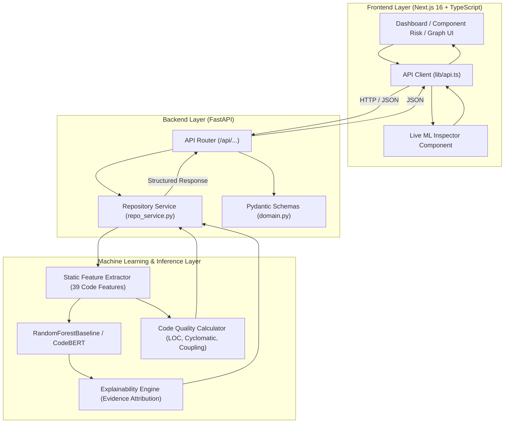

# SkyTrace — Repository Intelligence AI

[](https://www.python.org/)
[](https://nextjs.org/)
[](https://fastapi.tiangolo.com/)
[](https://tailwindcss.com/)
[](LICENSE)

SkyTrace (Repository Intelligence AI) is an end-to-end software intelligence platform that analyzes GitHub repositories to predict defect probabilities, highlight security vulnerabilities, map dependency call-graphs, assess pull-request blast radius, and provide explainable AI reasoning on software health.

---

## 1. Architecture Overview

SkyTrace unites a high-performance **Next.js 16 frontend**, a **FastAPI backend orchestration service**, and a **Machine Learning inference engine** into a cohesive system.



### Complete End-to-End Prediction Flow

```text
User Input / Code Snippet
          ↓
Frontend Live ML Inspector
          ↓
HTTP POST /api/predict/code
          ↓
FastAPI Pydantic Input Validation
          ↓
Static Feature Extractor (39 raw code features)
          ↓
Random Forest Classifier Model (Weights: rf_baseline.joblib)
          ↓
Calibrated Multi-Risk Scoring (Defect, Security, Regression)
          ↓
Explainable Evidence Factors & Similar Historical Pattern Search
          ↓
Structured API Response (ComponentRisk)
          ↓
Live Frontend UI & Health Score Update
```

---

## 2. Project Structure

```text
SkyTrace/
├── frontend/                     # Next.js 16 + TypeScript Application
│   ├── app/                      # App router pages (dashboard, repo, components, graph, PRs)
│   ├── components/               # React UI components (shadcn/ui, graph, live-ml-inspector)
│   ├── lib/
│   │   ├── api.ts                # Real backend API client
│   │   ├── types.ts              # TypeScript domain types matching PRD contract
│   │   └── mock-data.ts          # Resilient seed data & offline fallback
│   ├── public/                   # Static assets
│   ├── package.json              # Node dependencies
│   ├── tsconfig.json
│   └── Dockerfile
│
├── backend/                      # FastAPI Backend & ML Service
│   ├── app/
│   │   ├── api/                  # FastAPI routers and endpoints
│   │   │   ├── endpoints.py      # Repositories, components, health, graph, predict routes
│   │   │   └── __init__.py
│   │   ├── core/                 # Configuration & CORS settings (config.py)
│   │   ├── schemas/              # Pydantic validation schemas (domain.py)
│   │   ├── services/             # Repository state & ML orchestration (repo_service.py)
│   │   └── main.py               # FastAPI application entrypoint
│   │
│   ├── ml/                       # Integrated ML Service & Research Codebase
│   │   ├── features/             # 39 static features, history features, co-change graph
│   │   ├── inference/            # Production inference engine (engine.py)
│   │   ├── models/               # Model architectures (Random Forest, CodeBERT, Multimodal)
│   │   ├── weights/              # Serialized model weights (rf_baseline.joblib)
│   │   ├── configs/              # Experiment configs (YAML)
│   │   ├── reports/              # Baseline metrics, confusion matrices, ROC/PR curves
│   │   └── scripts/              # Research & training scripts
│   ├── requirements.txt          # Python dependencies
│   ├── Dockerfile
│   └── README.md
│
├── tests/                        # Automated Test Suite
│   ├── test_api.py               # FastAPI endpoint tests
│   ├── test_inference.py         # ML static feature and inference tests
│   ├── test_e2e_flow.py          # Complete user-to-prediction lifecycle test
│   └── ml/                       # ML dataset & research tests
│
├── scripts/                      # Tooling & launchers
│   └── dev.sh                    # One-command dual-service development launcher
│
├── .env.example                  # Environment configuration template
├── .gitignore                    # Unified Git ignore rules
├── docker-compose.yml            # Container orchestration for full stack
├── conftest.py                   # Pytest configuration and module shims
└── README.md                     # Project documentation
```

---

## 3. Prerequisites

* **Python**: `3.10` or higher
* **Node.js**: `18.18` or higher (`20+` recommended)
* **npm**: `9.0` or higher
* **Docker & Docker Compose** (optional, for containerized execution)

---

## 4. Installation & Setup

### Clone and Environment Configuration

```bash
# Clone the repository
git clone <repo-url>
cd SkyTrace

# Copy environment template
cp .env.example .env
```

### Install Backend Dependencies

```bash
python3 -m pip install -r backend/requirements.txt
```

### Install Frontend Dependencies

```bash
cd frontend
npm install
cd ..
```

---

## 5. How to Run

### Option A: Using the Dev Launcher (Recommended)

Run both the FastAPI backend and the Next.js frontend concurrently with one command:

```bash
./scripts/dev.sh
```

### Option B: Running Individually

**Terminal 1 — Backend:**
```bash
python3 -m uvicorn backend.app.main:app --host 0.0.0.0 --port 8000 --reload
```
* Backend API: `http://localhost:8000`
* Swagger OpenAPI Docs: `http://localhost:8000/docs`

**Terminal 2 — Frontend:**
```bash
cd frontend
npm run dev
```
* Web Application: `http://localhost:3000`

### Option C: Running with Docker Compose

```bash
docker-compose up --build
```

---

## 6. How the ML Pipeline Works

The SkyTrace ML pipeline operates in real time:

1. **Source Parsing & Static Feature Extraction (`backend/ml/features/static_features.py`)**:
   - Parses code into token streams and AST patterns.
   - Extracts **39 quantitative features** across code size, syntactic complexity, keywords, and security-critical function invocations:
     - Complexity: `cyclomaticComplexity`, `n_branches_if`, `n_loops_while`, `n_switch`, `n_distinct_tokens`.
     - Size: `length_chars`, `n_lines`, `n_code_lines`, `avg_line_length`.
     - High-Risk Invocations: `has_strcpy`, `has_gets`, `has_sprintf`, `has_malloc`, `has_free`, `has_memcpy`, `has_cast`.
2. **Model Inference (`backend/ml/inference/engine.py`)**:
   - Evaluates the feature vector against a trained `RandomForestBaseline` (300 estimators, balanced class weights tuned on vulnerability distributions).
   - Produces calibrated classification probabilities.
3. **Multi-Dimensional Risk Scoring**:
   - **Defect Risk (0–100%)**: Driven by cyclomatic complexity, nesting depth, and code volume.
   - **Security Risk (0–100%)**: Driven by dangerous APIs, buffer manipulation, memory management, and model probability.
   - **Regression Risk (0–100%)**: Driven by call coupling, dependency centrality, and external invocation count.
   - Categorized into standard tiers: `CRITICAL` (≥70%), `HIGH` (≥45%), `MEDIUM` (≥25%), and `LOW` (<25%).
4. **Explainability Attribution (`EvidenceFactor`)**:
   - Computes weighted contribution factors explaining *why* the code was flagged (e.g. `Unsafe memory / API usage (+34%)`, `Elevated cyclomatic complexity (+28%)`).
5. **Historical Pattern Matching**:
   - Compares the feature signature against known CVE/CWE vulnerability profiles (e.g. `CWE-120: Buffer Copy without Checking Size`, `CWE-613: Insufficient Session Expiration`).

---

## 7. Key API Endpoints

| Method | Endpoint | Description |
|---|---|---|
| `GET` | `/health` | System health and ML engine status |
| `GET` | `/api/repositories` | List connected repositories |
| `POST` | `/api/repositories/connect` | Connect a new GitHub repository |
| `GET` | `/api/repositories/{id}` | Get repository metadata |
| `GET` | `/api/repositories/{id}/health` | Get calculated health score & 14-day trend |
| `GET` | `/api/repositories/{id}/components` | List components with defect & security risk |
| `GET` | `/api/repositories/{id}/components/{cid}` | Detailed component risk, metrics & explainability |
| `GET` | `/api/repositories/{id}/graph` | Dependency and call graph (nodes and edges) |
| `GET` | `/api/repositories/{id}/security` | Security findings identified by static analysis & ML |
| `GET` | `/api/repositories/{id}/pull-requests` | AI-analyzed pull requests |
| `POST` | `/api/predict/code` | **Direct real-time ML inference on raw source code** |

---

## 8. Example API Request & Response

### Request: `POST /api/predict/code`

```bash
curl -X POST http://localhost:8000/api/predict/code \
  -H "Content-Type: application/json" \
  -d '{
    "code": "void handle_input(char* s) { char buf[16]; strcpy(buf, s); gets(buf); }",
    "path": "input_handler.c",
    "language": "C",
    "repositoryId": "repo-orbit-payments"
  }'
```

### Response: `200 OK`

```json
{
  "status": "success",
  "inferenceSource": "SkyTrace RandomForest ML Baseline + 39 Static Features",
  "component": {
    "id": "comp-input-handler",
    "repositoryId": "repo-orbit-payments",
    "path": "input_handler.c",
    "name": "input_handler.c",
    "type": "file",
    "language": "C",
    "defectRisk": 68,
    "securityRisk": 99,
    "regressionRisk": 51,
    "riskLevel": "CRITICAL",
    "metrics": {
      "loc": 3,
      "cyclomaticComplexity": 1,
      "functionLength": 3,
      "coupling": 1,
      "centrality": 0.20,
      "changeFrequency": 3,
      "duplication": 0,
      "historicalDefectFrequency": 0.54
    },
    "lastModified": "Just now (Live ML)",
    "lastModifiedBy": "SkyTrace ML Inference Engine",
    "evidence": [
      {
        "label": "Unsafe memory / API usage",
        "detail": "Detection of unchecked buffer or dangerous operations (strcpy/gets/insecure decode).",
        "weight": 0.34
      }
    ],
    "similarHistorical": [
      {
        "id": "cve-pattern-01",
        "title": "CWE-120: Unchecked buffer operation on input string",
        "type": "vulnerability",
        "similarity": 0.88,
        "repo": "upstream/openssl-history",
        "date": "2025-11-14",
        "summary": "Buffer copied without strict length bounding leading to potential memory overwrite."
      }
    ],
    "downstreamDependents": []
  }
}
```

---

## 9. Testing & Verification

Run the full automated test suite covering FastAPI startup, request validation, static feature extraction, baseline model forward pass, and the end-to-end prediction pipeline:

```bash
# Run all tests
python3 -m pytest tests/ -v
```

### Test Coverage Highlights:
- `tests/test_api.py`: FastAPI endpoints, validation error handling (422), 404 responses.
- `tests/test_inference.py`: 39 static feature extraction, safe vs vulnerable classification, metric extraction.
- `tests/test_e2e_flow.py`: Full user code input to structured prediction output flow.

To build and typecheck the Next.js frontend:
```bash
cd frontend && npm run build
```

---

## 10. Common Troubleshooting

1. **`Port 8000 already in use`**:
   Kill any zombie process on port 8000:
   ```bash
   lsof -ti:8000 | xargs kill -9
   ```

2. **Frontend cannot reach backend (`Inference Error`)**:
   Check that `NEXT_PUBLIC_API_URL` is set to `http://localhost:8000` in `.env` or that FastAPI is running on port 8000. Verify with:
   ```bash
   curl http://localhost:8000/health
   ```

3. **Missing Python packages**:
   Ensure dependencies are installed in your active Python environment:
   ```bash
   pip install -r backend/requirements.txt
   ```
